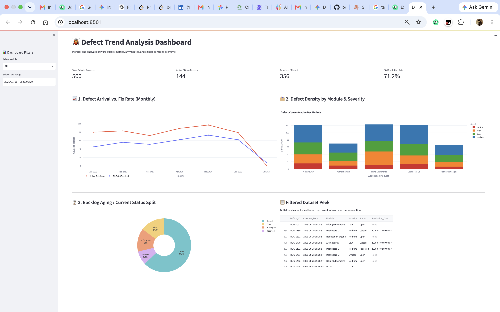

# 🐞 Defect Trend Analysis Dashboard Prototype

An interactive analytics dashboard built with **Python**, **Streamlit**, and **Plotly** to monitor software defect trends and visualize quality metrics over time.

The dashboard enables QA engineers and project teams to analyze defect patterns, monitor testing progress, and identify high-risk application modules through interactive visualizations.

---

# ✨ Features

### 📈 Defect Arrival Rate vs. Fix Rate

A time-series line chart comparing reported defects against resolved defects to measure engineering velocity and backlog trends.

### 📊 Defect Density Analysis

A stacked bar chart showing defect distribution across application modules, categorized by severity levels.

### 🍩 Defect Status Distribution

An interactive doughnut chart displaying the proportion of defects in each lifecycle stage:

* Open
* In Progress
* Resolved
* Closed

### 🎛 Interactive Filters

Sidebar controls allow filtering by:

* Date range
* Application module

This enables focused analysis of specific areas within the application.

---

# 📁 Project Structure

```text
.
├── app.py
├── generate_data.py
├── requirements.txt
├── output/
│   └── result.png
└── README.md
```

### Files

* **`app.py`** – Main Streamlit dashboard containing layouts and Plotly visualizations.
* **`generate_data.py`** – Generates six months of realistic synthetic software defect data.
* **`requirements.txt`** – Lists the required Python packages.
* **`output/result.png`** – Sample dashboard output.
* **`README.md`** – Project documentation.

---

# 🛠 Prerequisites

* Python 3.8 or later
* macOS, Windows, or Linux

---

# 🚀 Installation

## 1. Clone the Repository

```bash
git clone <your-public-git-repo-url>
cd defect-trend-analysis-dashboard
```

---

## 2. Create a Virtual Environment

```bash
python3 -m venv venv
```

### Activate the Virtual Environment

**macOS / Linux**

```bash
source venv/bin/activate
```

**Windows**

```bash
.\venv\Scripts\activate
```

---

## 3. Install Dependencies

```bash
pip install --upgrade pip
pip install -r requirements.txt
```

---

## 4. Generate the Sample Dataset

```bash
python generate_data.py
```

---

## 5. Run the Dashboard

```bash
streamlit run app.py
```

The dashboard will automatically open in your default browser at:

```text
http://localhost:8501
```

---

# 📸 Sample Output

The screenshot below shows the dashboard displaying defect trends, severity distribution, and defect status metrics.



---

# 📊 Dashboard Overview

The dashboard provides insights into software quality through multiple visualizations:

* Defect arrival rate over time
* Defect resolution trend
* Defect density by application module
* Severity-wise defect distribution
* Current defect status breakdown
* Interactive filtering for focused analysis

---

# 🧪 Technologies Used

* Python
* Streamlit
* Pandas
* Plotly

---

# 📄 License

This project is intended for educational and demonstration purposes.
